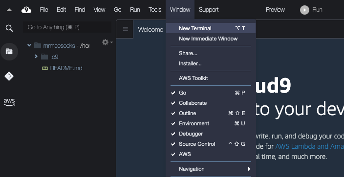
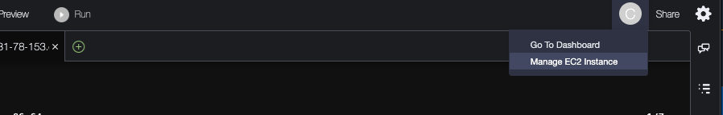
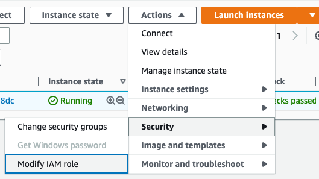

# Create Cloud9 Environment

## Create the Cloud9 Environment (instance)
Browse to [AWS Cloud9](https://us-east-1.console.aws.amazon.com/cloud9control/home?region=us-east-1#/product) product page.  
Click on Create Environment

Details
- Name: codedemo 
- Description - optional: Cloud9 IDE for EKS Learning
- Environment type: New EC2 instance (default)

New EC2 instance
- Instance Type: t3.small (I bump this from free tier in case I choose to implement a number of things)
- Platform: Amazon Linux 2 (default)

I leave the remainder at the defaults.  Review the warning at the bottom and click "Create"

## Increase the disk size
Once the Environment is up, click Open.  When you see the IDE, click Window | New Terminal  


You should run the following code at the command line (which will reboot the instance)

```
pip3 install --user --upgrade boto3
export instance_id=$(curl -s http://169.254.169.254/latest/meta-data/instance-id)
python -c "import boto3
import os
from botocore.exceptions import ClientError 
ec2 = boto3.client('ec2')
volume_info = ec2.describe_volumes(
    Filters=[
        {
            'Name': 'attachment.instance-id',
            'Values': [
                os.getenv('instance_id')
            ]
        }
    ]
)
volume_id = volume_info['Volumes'][0]['VolumeId']
try:
    resize = ec2.modify_volume(    
            VolumeId=volume_id,    
            Size=30
    )
    print(resize)
except ClientError as e:
    if e.response['Error']['Code'] == 'InvalidParameterValue':
        print('ERROR MESSAGE: {}'.format(e))"
if [ $? -eq 0 ]; then
    sudo reboot
fi
```

## Create IAM Role for Workspace
The following is a "intelligent link" that will begin the steps to create a role that will "Allows EC2 instances to call AWS services on your behalf."

Click on https://console.aws.amazon.com/iam/home#/roles$new?step=review&commonUseCase=EC2%2BEC2&selectedUseCase=EC2&policies=arn:aws:iam::aws:policy%2FAdministratorAccess&roleName=codedemo
Click Next: Permissions  
Cick Next: Tags (ensure that AdministratorAccess is checked

## Attach Role to Cloud9 Environment
In your Cloud9 Instance, look at the upper right corner and click on your icon and select "Manage EC2 Instance"
 (will open another tab)  
Select your EC2 Instance used for Cloud9 (starts with "aws-cloud9-codedemo") and click Actions | Security | Modify IAM role and select your newly created role ("codedemo" in my case), then click "Update IAM role"



